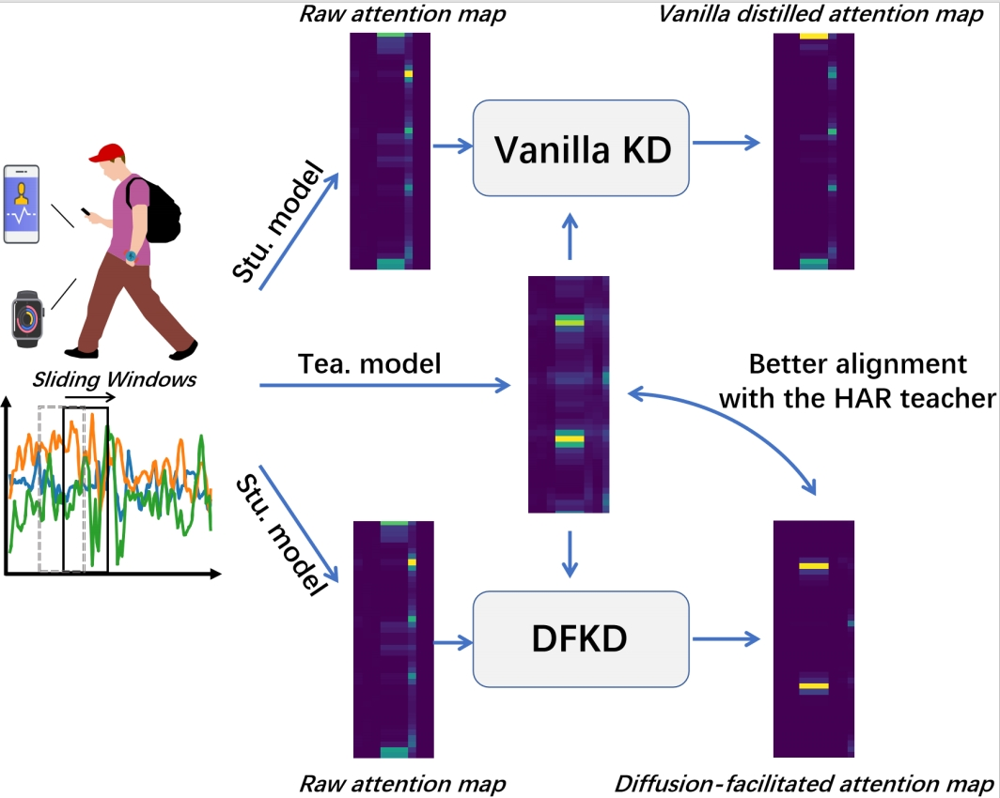

The rapid growth of IoT devices and miniaturized sensors has significantly advanced Human Activity Recognition (HAR), with deep learning techniques playing a pivotal role in automating feature extraction from raw sensor data. However, deploying deep learning models in resource-constrained environments remains a challenge due to their high computational requirements. Knowledge Distillation (KD) presents a promising solution by transferring knowledge from large teacher models to compact student models. Traditional KD approaches, though effective, often face performance degradation due to the capacity gap between teacher and student networks, as well as the noise present in student features. To overcome these challenges, we introduce Diffusion Facilitated Knowledge Distillation (DFKD), a novel diffusion-based framework for knowledge distillation that effectively denoises student features and reduces computational overhead through autoencoder-assisted feature compression. DFKD leverages diffusion models to enhance the robustness of knowledge transfer, ensuring better alignment between teacher and student models. Extensive experiments on benchmark datasets, including UCI-HAR, UNIMIB-SHAR, and PAMAP2, show that DFKD outperforms state-of-the-art methods in terms of both accuracy and efficiency. 

This is the code for the RRKD project, which will be uploaded after the article is published.
